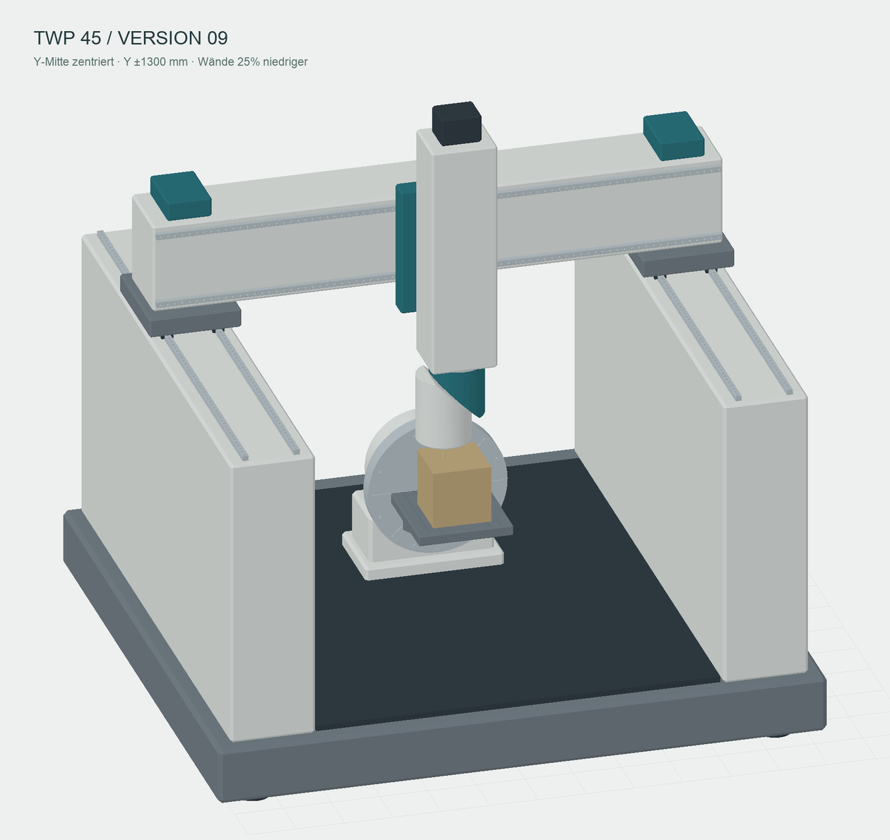

# TWP 45 wall-gantry example

An independently drawn replacement candidate for the TWP demo: two continuous
walls support a travelling crossbeam, with a substantial offset 45° universal
head and an A-axis faceplate. The existing `lcnc_suite_sim_twp.ini` remains
available. This example shares its TWP remaps, six-joint HAL and switchable
kinematics; it has a separate INI, parameter file and tool table.



## Run on the LinuxCNC host

Use a checkout containing this example, with lcnc-suite installed from that
checkout as described in the [main README](../../../README.md). From its root:

```sh
git lfs pull
sudo halcompile --install examples/sim_config/twp/xyzacb_trsrn.comp
cd examples/sim_config
linuxcnc lcnc_suite_sim_twp_gantry.ini
```

Compile the runtime component once, and again when that `.comp` changes.
The separate `scripts/kins_oracle/` copy is for tests, not installation.
The new example defaults to `WEBUI_HOST = 127.0.0.1`; remote access uses the
same token settings as the other sims.

Launch from the complete checkout as above. The model path is relative to
the INI directory, which is also the LinuxCNC display/gateway working
directory. The remap and suite subroutine paths likewise follow this layout.
If launching the gateway manually from elsewhere, set
`LCNC_WEBUI_MACHINE_DIR` to this model directory's absolute path.
`install.sh` preserves an already deployed sim directory; re-running it does
not add new example INIs to that existing copy. Do not copy just this INI
into the old deployed directory without its model, state files and referenced
subroutine paths.

Arm, reset E-stop, enable and home all axes in the usual way. Startup is empty
and parked at all joints zero. The new `sim_twp_gantry.var` seeds G54 at the
centre of the 600 mm stock's top face at A=0:

| Datum / pose | X | Y | Z |
| --- | ---: | ---: | ---: |
| G54 in machine coordinates | -100 | 140 | -725 |
| Ram centred, spindle retracted (joint coordinates) | 0 | 0 | 0 |
| Spindle above the work (joint coordinates, A=B=C=0) | 0 | 140 | -475 |

At the last pose, the nose is 850 mm above the A axis. The supplied T1 has
200 mm gauge length and 14 mm diameter, leaving its tip 50 mm above the
stock. The tool is defined in `tool_twp_gantry.tbl`, not baked into an STL.
Normal tool loading and G43 apply; identity/TCP/plane coordinates are different
after switching modes.

The old `twp/demos/simple_example.ngc` sets its own old-machine offsets.
It is **not adapted to this gantry**. Its programs and saved offsets must be
reworked before using them here. This example is intended to be selected and
evaluated alongside the existing demo before a later replacement.

## Kinematic contract

| Geometry pin | Value |
| --- | ---: |
| `nut-angle` | 45° |
| `y-pivot` / `z-pivot` | 140 / 480 mm |
| `x-offset` / `y-offset` | 0 / 0 mm |
| `y-rot-axis` / `z-rot-axis` | 140 / -1325 mm |

All seven values are direct `[HAL] HALCMD = setp ...` lines so the runtime,
gateway and offline TWP remap see the same geometry. Keep them and the model
frames together when modifying the design.

The linear chain is `x_bridge → y_saddle → xyz_head`. C rotates about +Z;
B rotates about `(0, sin45°, cos45°)` in the C frame. The A faceplate rotates
about -X and carries `a_work`. The neutral spindle axis is deliberately
140 mm behind the C/ram axis in Y. Y=0 centres the ram between the walls;
Y=140 centres the neutral spindle on the table. The work/tool frame origins
match the kinematics despite this offset.

| Joint | Limits |
| --- | --- |
| X | -1500 … +1500 mm |
| Y | -1300 … +1300 mm |
| Z | -1325 … +0.01 mm (nominal upper end 0) |
| A / B / C | ±360° / ±185° / ±320° |

Z0 is the retracted position. The +0.01 mm allowance keeps HOME=0 strictly
inside the limit window. `hallib/limit_window.hal` lifts world XYZ limits
under TCP/TOOL as in the existing TWP demo; the joint limits still constrain
the physical slides.

## Geometry and validation

- 32 STL parts in group-local millimetres, generated from FreeCAD solids.
- Walls 3075 mm high with inner faces at Y=±2110 mm.
- Two X rails per wall, two blocks per rail, four blocks under each separate
  1110 × 950 × 200 mm saddle plate; plates and crossbeam share their X centre.
- Two Y rails/four blocks and two Z rails/four blocks. All use the same
  simplified 63 × 53 mm rail / 126 × 295 mm block / 90 mm assembly dimensions.
- Both head housings are Ø560 mm, with broad shoulders at the 45° cut and
  short Ø380 mm connecting bosses. The B joint has 4 mm minimum separation.

`machineGantry.test.ts` checks the shipped INI and meshes, the model chain
against the oracle-backed `TrsrnKins` implementation over 303 poses, symmetric
wall clearance, and an intended sequence of linear-limit and parked rotary
moves through the actual collision sweep. The current BVH reports the close
diagonal head bearing faces as static contacts; an independent separating-plane
check proves their 4 mm gap for every B angle, so baseline subtraction cannot
hide a head-half intersection. The test does not assert that arbitrary
simultaneous six-axis moves clear the fixture or stock.

The continuous wall bound includes every B/C orientation and full Y travel,
with a 200 mm × Ø14 mm tool and a 1.3 mm housing tessellation allowance:
at least **114 mm on either side**. Longer/wider tools need a new check.
The CAD and compiled LinuxCNC kinematics were also checked off-machine during
development. Live LinuxCNC startup, homing, TCP/plane switching and adapted
TWP programs still need evaluation before promoting this to the default demo.

## Rebuild or edit

FreeCAD is only needed to change geometry. The committed meshes are ready to
load after `git lfs pull`. From the repository root, with FreeCAD available:

```sh
FreeCADCmd -c "import runpy; runpy.run_path('scripts/freecad_twp_gantry.py', run_name='__main__')"
```

The executable may be named `freecadcmd` on your installation. For an editable
assembly with a six-axis Motion spreadsheet, a STEP export, and a geometry
report, supply an export directory:

```sh
TWP_GANTRY_CAD_DIR=/tmp/twp-gantry-cad FreeCADCmd -c "import runpy; runpy.run_path('scripts/freecad_twp_gantry.py', run_name='__main__')"
```

This writes the 32 STLs and `machine.json` back into this folder; optional CAD
files go only to the chosen directory. STL export poses are local and
independent of the saved CAD assembly pose. Verify a change with:

```sh
cd lcnc-webui
npm ci
npm test -- src/viewer/machineGantry.test.ts src/viewer/kinsFixtures.test.ts
npm run build
```

This is a simulation concept, not a load-rated mechanical design. Geometry
and generator are GPL-2.0-or-later; see [NOTICE](../../../NOTICE). No DMU meshes
or manufacturer photographs are redistributed. Simplified guide dimensions
reference [HIWIN's RGR-R series](https://www.hiwin.de/en/Products/Linear-guideways/Profile-rails/Roller-guides/Series-RGR/RGR-R/c/4515)
and the RGH65HA dimensional table in its linear-guide catalogue.
